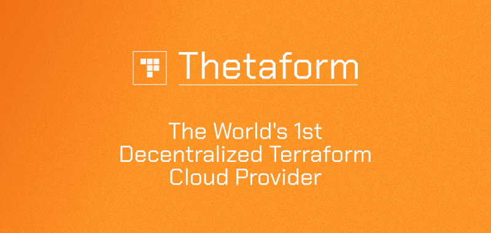
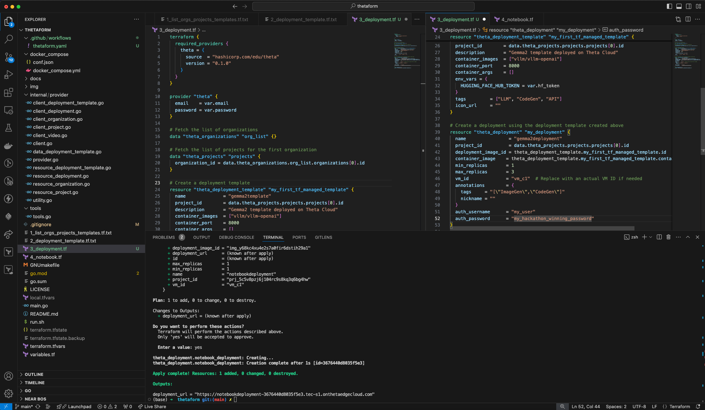
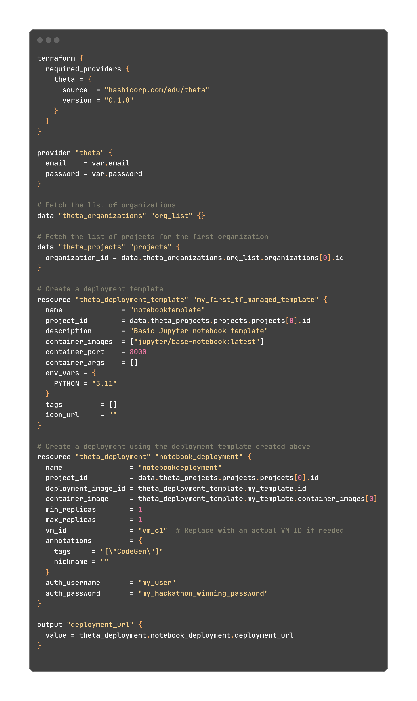

# Thetaform



Thetaform is a Terraform provider for Theta EdgeCloud. It lets you manage your Theta Network infrastructure as code using Terraform configuration files, bringing standard DevOps enterprise best practices to the Theta distributed compute network.

Here is a Theta Hackathon 2024 submission page on DevPost deatailing the project: https://devpost.com/software/thetaform

Check out the landing page for more info: https://thetaform.cloud

Watch a 5-minute walthrough of basic Thetaform usage:
[](https://www.youtube.com/watch?v=FRjKTVJP9Ro)


## Features

- **Infrastructure as Code**: Define and provision your Theta EdgeCloud resources using Terraform configuration files.
- **Automation**: Use Terraform’s automation capabilities to manage, update, and destroy your Theta Network infrastructure.
- **Consistency**: Ensure consistent deployment and management of your Theta infrastructure across different environments.




## Getting Started

### Prerequisites

- **Terraform**: You need Terraform installed on your local machine -> [Install Terraform](https://www.terraform.io/downloads).
- **Golang**: Install Golang compiler, since you'll need to build Thetaform locally -> [Install Golang](https://go.dev/doc/install).

### Setup

1. **Clone the Repository**

   ```bash
   git clone https://github.com/igorperic17/thetaform.git
   cd thetaform
2. **Configure Terraform for local provider install**

Since Thetaform is (yet!) not a part of the official HashiCorp set of providers, you will have to "trick" Terrafrom to look for a provider named "theta" in a custom path on your system, namely ~/go/bin. To do that, you'll have to add this content to your ~/.terraformrc file:
    
    provider_installation {
        dev_overrides {
            "hashicorp.com/edu/theta" = "~/go/bin"
        }

        direct {}
    }

The path might not support "~", so make sure to provide absolute path (/User/\<username> on Mac or /home/\<username> on Linux).

3. **Configure Theta account credential**

Create a file "local.tfvars" in the root of the repo with the following content:

    email    = "<your_theta_account_email>"
    password = "<your_theta_account_password>"
    hf_token = "<your_hf_token>"

Make sure you leave the quotes in when replacing placeholders.

4. **Deploy**

Technically you are ready to deploy, the only caveat is your provider is not built!

To do that you would have to run

    go install .

This will build and install Thetaform provider into ~/go/bin, after which you are ready to run

    terraform apply
    

If everything went well you should see the link to your new IPython Notebook at the end of the successful deployment in your terminal.

There are 4 example Terraform configuration files in the root of the repo, out of which the first three have .txt extension to prevent Terraform to apply all of them and cause conflicts. If you wish to test out other files or write your own, be aware that Terraform will apply ALL of the *.tf files in the current working directory.

## Known issues and limitations

- Organizations and Projects have only data (read-only) resources
- Deployments can only be created, update and delete is currently being implemented
- Video resource is not yet implemented


## Contributing
We welcome contributions to Thetaform! If you have any improvements or bug fixes, please submit a pull request or open an issue.

## License
Thetaform is licensed under the MIT License.

## Contact
For any questions or support, please contact me at igorperic@live.com.